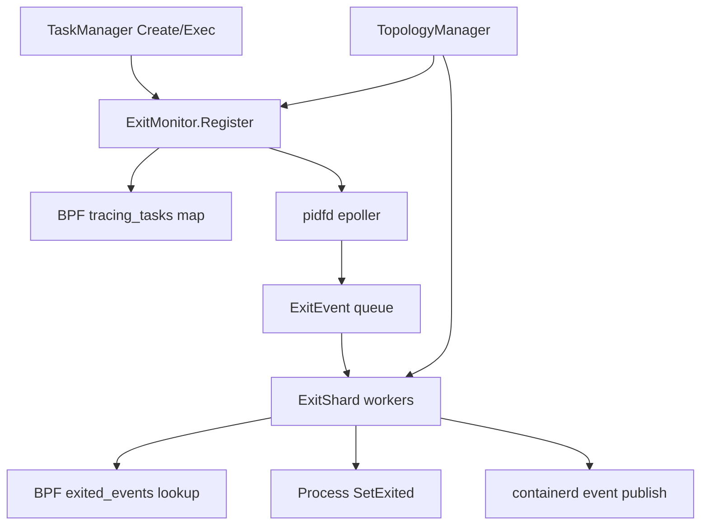

# ARM Affinity Runtime Design

## Summary

This design adds ARM-aware behavior to embedshim without binding the runtime to a single ARM vendor. The goal is to improve container lifecycle control-plane performance on ARM64 servers by combining build-time ARM feature profiles, Linux topology discovery, unified exit monitoring, NUMA-aware event processing, and measurable latency SLOs.

The first competitive target is not handwritten ARM assembly. It is stable low-tail-latency process lifecycle management under high container and exec churn on many-core ARM machines.

## Goals

- Support ARM64 build profiles that can use ARMv8.1 LSE atomics when available.
- Replace split init/exec exit tracking with one `ExitMonitor` path.
- Make BPF map capacity and pidfd event handling tunable.
- Decouple pidfd `epoll_wait` from exit callback execution.
- Add NUMA-aware worker sharding for ARM64 server platforms.
- Respect Kubernetes/containerd cpuset decisions by default.
- Add metrics that prove whether ARM affinity helps.

## Non-Goals

- Do not override Kubernetes CPU Manager or Topology Manager decisions by default.
- Do not introduce vendor-specific behavior in the core runtime path.
- Do not require Kunpeng, Graviton, Ampere, Cobalt, or any specific ARM platform.
- Do not handwrite ARM assembly in the first iteration.
- Do not migrate the whole project to containerd 2.x in this design. That is a separate productization track.

## Current Problems

The existing runtime has three bottleneck-prone areas:

1. BPF map capacity is fixed in `bpf/exitsnoop.bpf.c`.
   Both `tracing_tasks` and `exited_events` are hard-coded to `2048` entries. High churn workloads can exceed that capacity and lose reliable exit tracking.

2. Init and exec use different BPF attach/store paths.
   Init processes use pinned BPF maps. Exec processes use a separate in-memory attach path. This duplicates tracepoint work and splits lifecycle semantics.

3. pidfd callbacks are processed serially.
   `Epoller.Run()` drains pidfd events and calls `onClose()` inline. If one callback is slow, all subsequent exit notifications wait behind it.

These problems matter more on high-core-count ARM servers because global locks, global queues, and cross-NUMA execution can amplify tail latency.

## Architecture

The design introduces four units:

- `BuildProfile`: selects generic ARM64 or ARM64 server build flags.
- `TopologyManager`: discovers ARM64 CPU, NUMA, cgroup, and feature topology.
- `ExitMonitor`: owns BPF maps, pidfd registration, epoll draining, and exit event dispatch.
- `ExitShard`: processes exit callbacks in per-shard worker pools, optionally bound to CPU sets.



## Build Profiles

The runtime should support at least two ARM64 build profiles:

- `generic-arm64`: maximum compatibility, `GOARCH=arm64`, `GOARM64=v8.0`.
- `server-arm64-lse`: ARM server profile, `GOARCH=arm64`, `GOARM64=v8.1,lse`.

The LSE profile benefits high-concurrency paths that depend on atomic operations in Go runtime, locks, channels, counters, and queues. It should be released as a separate artifact or package variant, not as the only ARM64 binary.

Configuration:

```toml
[arm]
build_profile = "generic-arm64" # generic-arm64 | server-arm64-lse
```

Initial containerd plugin configuration:

```toml
[plugins."io.containerd.runtime.v1.embed"]
bpf_map_max_entries = 32768
epoll_batch_size = 512
pidfd_callback_workers = 4
pidfd_callback_queue_depth = 8192
arm_affinity_mode = "runtime-only"
arm_affinity_sharding = "numa"
arm_affinity_bind_workers = true
```

Runtime must still detect features and log mismatches clearly. If a binary requires features unavailable on the host, startup should fail with a direct error message.

## TopologyManager

`TopologyManager` reads Linux standard interfaces:

- `/proc/cpuinfo`
- `/sys/devices/system/cpu/cpu*/topology/*`
- `/sys/devices/system/node/node*/cpulist`
- `/sys/devices/system/node/node*/meminfo`
- cgroup v2 `cpuset.cpus.effective`
- cgroup v2 `cpuset.mems.effective`

It returns a host model:

```go
type Topology struct {
    Arch       string
    Features   FeatureSet
    NUMANodes  []NUMANode
    CPUs       []CPUInfo
    Cgroup     CgroupPlacement
}

type NUMANode struct {
    ID      int
    CPUs    CPUSet
    MemNode int
}
```

The manager is read-only in the first iteration. It discovers placement but does not change container cpusets unless an explicit policy enables that behavior.

## ExitMonitor V2

`ExitMonitor` replaces separate init/exec tracking with one API:

```go
type ExitTarget struct {
    TraceID     uint64
    PID         uint32
    Kind        ProcessKind // init or exec
    Namespace   string
    ContainerID string
    ExecID      string
    PidNS       exitsnoop.PidnsInfo
    Placement   PlacementHint
    OnExit      func(ExitResult) error
}

type ExitMonitor interface {
    Register(context.Context, ExitTarget) error
    Unregister(context.Context, uint64) error
    Run(context.Context) error
    Close() error
}
```

Behavior:

- Load and attach one BPF program for all init and exec targets.
- Use one trace ID allocator and one BPF map pair.
- Store process kind and placement metadata in userspace.
- Keep pinned maps for restart recovery.
- On restart, reload targets from persisted bundle state and reconcile with BPF maps.

The BPF value can stay minimal. Rich metadata should live in userspace to keep verifier complexity low.

## Configurable BPF Capacity

Add runtime configuration:

```toml
[plugins."io.containerd.runtime.v1.embed"]
bpf_map_max_entries = 32768
epoll_batch_size = 512
pidfd_callback_workers = 4
pidfd_callback_queue_depth = 8192
arm_affinity_mode = "runtime-only"
arm_affinity_sharding = "numa"
arm_affinity_bind_workers = true
```

Implementation choice:

- Load BPF object into `ebpf.CollectionSpec`.
- Before `ebpf.NewCollection`, set `spec.Maps["tracing_tasks"].MaxEntries`.
- Apply the same value to `exited_events`.
- If existing pinned maps have incompatible capacity, fail fast with a clear migration message.

This avoids pretending BPF maps can be safely resized after creation.

## Async pidfd Event Handling

The epoll goroutine must only drain events:

```go
for {
    events := epollWait()
    for _, ev := range events {
        removeFromEpoll(ev.fd)
        close(ev.fd)
        enqueue(ExitEvent{TraceID: traceID, PID: pid})
    }
}
```

Workers process callbacks:

```go
for event := range queue {
    status := exitedEvents.Lookup(event.TraceID)
    target := registry.Get(event.TraceID)
    target.OnExit(status)
}
```

The queue is bounded. If full, the default policy is to block and increment a `queue_backpressure_total` counter. Dropping exit events is not allowed by default because it breaks lifecycle correctness.

Errors from callbacks must be recorded and exposed through metrics. `Run()` errors must be surfaced to `TaskManager` instead of silently disappearing.

## NUMA-Aware Sharding

When `arm.affinity.mode` enables sharding, the monitor creates shards:

```text
ExitMonitor
  shard 0: NUMA node 0 queue + workers
  shard 1: NUMA node 1 queue + workers
  shard N: NUMA node N queue + workers
```

Shard selection:

1. If the target process cgroup has a single effective memory node, use that node.
2. Else if the target cpuset maps mostly to one NUMA node, use that node.
3. Else hash by trace ID to spread load.

Worker affinity:

- Workers may call `runtime.LockOSThread()`.
- The locked OS thread may call `sched_setaffinity` with the shard CPU set.
- If affinity fails, log once and continue without affinity.

Default policy:

```toml
[arm.affinity]
mode = "runtime-only" # off | runtime-only | inherit | enforce
sharding = "numa"     # off | numa | hash
bind_workers = true
```

Mode semantics:

- `off`: no ARM-specific behavior.
- `runtime-only`: bind only embedshim worker threads; do not modify workload cpuset.
- `inherit`: align worker shard selection with workload cpuset, but do not modify it.
- `enforce`: explicitly set workload cpuset/memset according to policy. This is experimental and disabled by default.

## Workload Placement Policy

The default is to respect upstream placement. Container cpuset and memory placement are owned by Kubernetes/containerd/runc unless the user explicitly opts in.

Future opt-in annotations can be supported:

```text
embedshim.arm.affinity/mode=inherit
embedshim.arm.affinity/numa-policy=local
embedshim.arm.affinity/preferred-node=1
```

The runtime must refuse conflicting policies instead of silently overriding cpuset constraints.

## Metrics

Expose these metrics:

- `embedshim_exit_trace_register_total`
- `embedshim_exit_trace_register_errors_total`
- `embedshim_bpf_map_capacity`
- `embedshim_bpf_map_entries`
- `embedshim_bpf_exit_lookup_miss_total`
- `embedshim_pidfd_events_total`
- `embedshim_pidfd_epoll_drain_seconds`
- `embedshim_exit_queue_depth`
- `embedshim_exit_queue_backpressure_total`
- `embedshim_exit_callback_seconds`
- `embedshim_exit_notify_seconds`
- `embedshim_exit_unexpected_status_total`
- `embedshim_exit_shard_events_total{node=...}`

Initial implementation note: pidfd counters are published through the standard `expvar` key `embedshim_pidfd` while this older containerd plugin shape is kept intact.

Primary SLO:

- Under configured churn load, P99 exit notification latency must remain below the project-defined threshold.
- P999 should not grow linearly with container or exec concurrency.
- Unexpected exit status count must remain zero in normal runs.

## Validation Plan

Test scenarios:

1. Short-lived container churn.
   Create and exit many containers per second, measure exit notification latency.

2. Exec churn.
   Run many short-lived exec processes inside long-running containers.

3. Containerd restart recovery.
   Restart containerd while containers are running and verify exit status recovery.

4. BPF map pressure.
   Set low `bpf_map_max_entries`, verify clear failures and metrics.

5. Worker backpressure.
   Artificially slow callbacks, verify epoll drain remains fast and queue metrics show pressure.

6. ARM NUMA profile.
   Compare `off`, `runtime-only`, and `inherit` modes on an ARM64 NUMA host.

Success criteria:

- No lost exit events under expected capacity.
- No silent epoll loop death.
- Lower or flatter P99/P999 exit notification latency under churn.
- No regression in container create/start/delete correctness.
- Worker affinity can be disabled without changing correctness.

## Rollout Plan

1. Add metrics around the current path.
2. Make BPF map capacity configurable.
3. Introduce `ExitMonitor` API while keeping current behavior.
4. Move init tracking onto `ExitMonitor`.
5. Move exec tracking onto `ExitMonitor`.
6. Split epoll drain and callback execution.
7. Add `TopologyManager` in read-only mode.
8. Add NUMA shards with affinity disabled by default.
9. Enable `runtime-only` ARM affinity profile.
10. Benchmark and tune defaults.

Implementation status in this branch:

- Items 1-9 have code-level support behind compatibility-preserving defaults.
- Item 10 has validation scripts and build targets, but still needs Linux/ARM64 benchmark data before changing defaults.

## Risks

- BPF pinned map migrations can be disruptive. Mitigate with versioned pinned paths and clear startup errors.
- Worker pool concurrency can reorder callback completion. Preserve per-trace correctness and avoid assuming global ordering.
- Thread affinity can interact badly with Go scheduling. Keep it optional and limited to locked worker threads.
- NUMA policies can conflict with Kubernetes placement. Default to inherit and never override without opt-in.
- ARM feature-specific binaries can fail on older hosts. Publish a generic ARM64 artifact as the default.

## Open Decisions

- Whether to store process kind in BPF map value or only in userspace.
- Whether exec exit events need restart recovery equal to init events.
- Which metrics backend to use in this older containerd v1.5 plugin shape.
- Whether `enforce` workload placement belongs in this project or should remain an external scheduler concern.
